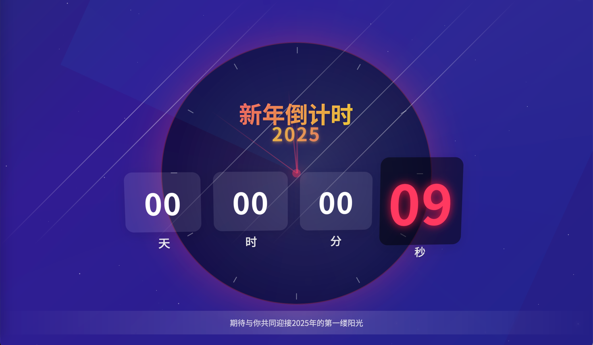

# 新年倒计时&烟花

实现新年倒计时后放烟花的效果

预览地址：https://likaihua17.github.io/NewYearClock




## 功能特性

- 🎵 **背景音乐**: 支持自动播放和手动控制
- 📝 **歌词显示**: 实时同步歌词，支持自定义歌词内容
- ⏰ **倒计时显示**: 实时显示距离目标时间的倒计时
- 🎆 **烟花效果**: 倒计时结束后自动跳转到烟花页面
- 📱 **响应式设计**: 完美适配桌面端和移动端
- ✨ **视觉效果**: 3D动画、粒子效果、光束等丰富的视觉体验

## 背景音乐功能

### 音乐控制
- **自动播放**: 页面加载后自动开始播放背景音乐
- **手动控制**: 点击右上角音乐按钮可播放/暂停音乐
- **循环播放**: 音乐会自动循环播放
- **音量调节**: 默认音量设置为30%，适合背景播放

### 歌词显示功能
- **实时同步**: 歌词与音频播放进度实时同步
- **高亮显示**: 当前播放的歌词行会高亮显示
- **自动滚动**: 歌词会自动滚动到当前播放位置
- **显示控制**: 支持显示/隐藏歌词，快捷键L键切换
- **自定义歌词**: 可以在配置文件中自定义歌词内容和时间

### 支持的音频格式
- MP3格式音频文件
- 支持多种音频源，确保兼容性

### 音频文件
项目包含以下背景音乐文件：
- `audio/lift1.mp3` - 轻音乐1
- `audio/lift2.mp3` - 轻音乐2  
- `audio/lift3.mp3` - 轻音乐3

## 歌词自定义

### 修改歌词内容
1. 打开 `lyrics-config.js` 文件
2. 修改 `COUNTDOWN_LYRICS`（倒计时页面歌词）
3. 修改 `FIREWORK_LYRICS`（烟花页面歌词）

### 歌词格式
```javascript
{ time: 0, text: "歌词内容" }
```
- `time`: 时间戳（毫秒），从0开始
- `text`: 歌词文本内容

### 示例
```javascript
const CUSTOM_LYRICS = [
    { time: 0, text: "第一句歌词" },
    { time: 5000, text: "第二句歌词" },
    { time: 10000, text: "第三句歌词" }
];
```

## 使用说明

1. **倒计时页面**: 显示生日倒计时，右上角有音乐控制按钮，中央显示歌词
2. **烟花页面**: 倒计时结束后自动跳转，同样支持背景音乐和歌词显示
3. **音乐控制**: 点击音乐按钮切换播放/暂停状态
4. **歌词控制**: 点击歌词区域右上角按钮切换显示/隐藏，或按L键
5. **响应式**: 在不同设备上自动调整布局和音乐控制按钮大小

## 技术说明

- 本项目基于 [Firework_Simulator](https://github.com/NianBroken/Firework_Simulator) 进行二次开发
- 使用现代Web技术：HTML5、CSS3、JavaScript ES6+
- 支持自动播放策略，兼容现代浏览器的音频播放限制
- 页面可见性API，智能管理音乐播放状态

## 浏览器兼容性

- Chrome 66+
- Firefox 60+
- Safari 11+
- Edge 79+

## 许可证

本项目采用 Apache-2.0 许可证
